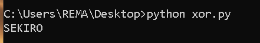
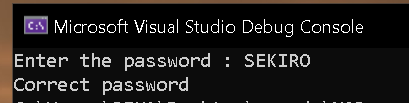

# XOR Password Verification

## Original C Code

The program takes a password from the user, XORs every character with the key `0x0A`, and compares the transformed result against a hardcoded value.

```c
#include <stdio.h>
#include <string.h>

int main(void) {
    char user_input[10];

    printf("Enter the password : ");
    scanf_s("%9s", user_input, 10);

    char password[] = {
        'S' ^ 0xA,
        'E' ^ 0xA,
        'K' ^ 0xA,
        'I' ^ 0xA,
        'R' ^ 0xA,
        'O' ^ 0xA,
        '\0'
    };

    for (int i = 0; user_input[i] != '\0'; i++) {
        user_input[i] ^= 0x0A;
    }

    if (strcmp(user_input, password) == 0) {
        printf("Correct password");
    }
    else {
        printf("Wrong password");
    }
}
```

## Decompiled Analysis

Looking at the decompiled code in Ghidra, the input handling logic is easy to identify:

```c
printf("Enter the password : ");
scanf_s("%9s");
builtin_strncpy(local_114, "YOACXE", 7);
```

Using the Strings window reveals the hardcoded string:

```text
YOACXE
```

The string is copied into a local buffer:

```c
builtin_strncpy(string, "YOACXE", 7);
```

Renaming the destination variable to `string` makes the code easier to understand.

At this point we know that:

* The program accepts user input.
* A hardcoded string `YOACXE` exists in the binary.
* The input is eventually compared against this string.

## Analyzing the Loop

Further down the function we encounter the following code:

```c
for (local_f4 = 0; local_140[local_f4] != 0; local_f4 = local_f4 + 1) {
    local_140[local_f4] = local_140[local_f4] ^ 10;
}

iVar1 = strcmp(local_140, string);
```
The loop iterates through every character of the input until the null terminator is reached.
For each iteration, the current character is XORed with the value `0x0A`.
Once the transformation is complete, the modified input is compared against the hardcoded string using `strcmp()`.


```c
for (i = 0; user_input[i] != '\0'; i++) {
    user_input[i] ^= 0x0A;
}

iVar1 = strcmp(user_input, string);
```
After renaming variables, the logic becomes lot clear.

## Reconstructing the Original Password

Since XOR is reversible, applying the same XOR operation again restores the original value.

The verification logic can be represented as:

```text
user_input XOR 0x0A = "YOACXE"
```

Reversing the operation:

```text
user_input = "YOACXE" XOR 0x0A
```

The following Python script performs the reversal:

```python
s = "YOACXE"
key = 0x0A

result = ""

for c in s:
    result += chr(ord(c) ^ key)

print(result)
```

Xor result:




## Output 



We can see that we have successfully found the correct password.

## Comparison With Original Source

The recovered string matches the original password used during compilation:

```c
'S' ^ 0xA
'E' ^ 0xA
'K' ^ 0xA
'I' ^ 0xA
'R' ^ 0xA
'O' ^ 0xA
```

This demonstrates how Ghidra represents a simple XOR-based password verification routine after decompilation and how the original logic can be reconstructed from the generated code.

## Key Takeaways

* String literals are often visible through the Strings window even after compilation.
* Variable renaming significantly improves decompiled code readability.
* XOR obfuscation is easily reversible because XOR is its own inverse.
* Loop structures in decompiled code can often be mapped directly back to their original C implementation.
* Comparing the original source code with the decompiled output is a useful exercise for understanding how high-level constructs appear after compilation.
