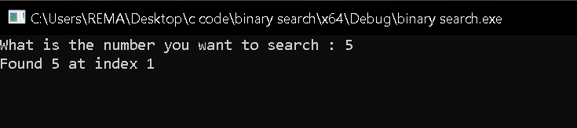

## Array Initialization and Search Bounds

After reading the user's input, the program initializes a sorted integer array along with several variables used during the search process.

```c
array[0] = 1;
array[1] = 5;
array[2] = 7;
array[3] = 0xb;
array[4] = 0x13;

size = 5;
lower_end = 0;
higher_end = 4;
```

At first glance, `size` appears to represent the number of elements in the array, while the purpose of `lower_end` and `higher_end` is not yet clear.

The corresponding assembly provides additional context:

```asm
MOV dword ptr [RBP + local_180],0x1
MOV dword ptr [RBP + local_17c],0x5
MOV dword ptr [RBP + local_178],0x7
MOV dword ptr [RBP + local_174],0xb
MOV dword ptr [RBP + local_170],0x13

MOV dword ptr [RBP + local_154],0x5
MOV dword ptr [RBP + local_134],0x0

MOV EAX,dword ptr [RBP + local_154]
DEC EAX
MOV dword ptr [RBP + local_114],EAX
```

The array initialization is identical to the decompiled output. More importantly, the assembly shows how `higher_end` is derived. The program loads the value stored in `size`, decrements it by one, and stores the result in `higher_end`.

```c
higher_end = size - 1;
```

Since the array contains five elements, the valid indices range from `0` to `4`. This allows us to identify the purpose of these variables:

```c
lower_end = 0;
higher_end = 4;
```

These values represent the lower and upper bounds of the search range.

## Midpoint Calculation

The next section calculates the midpoint of the current search range.

```c
puVar2 = (uint *)(ulonglong)(uint)(lower_end + higher_end >> 0x1f);
mid_point = (lower_end + higher_end) / 2;
```

The decompiler introduces the temporary variable `puVar2`, but the relevant operation is the calculation of `mid_point`.

```c
mid_point = (lower_end + higher_end) / 2;
```

With the initial bounds:

```c
mid_point = (0 + 4) / 2;
mid_point = 2;
```

The assembly confirms this calculation:

```asm
ADD EAX,param_1+0x4
MOV EAX,param_1+0x4
CDQ
SUB EAX,param_2+0x4
SAR EAX,0x1
MOV dword ptr [RBP + local_f4],EAX
```

The resulting midpoint is stored in `local_f4`, which corresponds to index `2` of the array.

## Target Comparison

Once the midpoint has been calculated, the program compares the user supplied value against the element located at the midpoint.

```c
if (user_input[1] == array[(int)mid_point]) {
    printf("Found %d at index %d",
           user_input[1],
           mid_point);
}
```

The equivalent assembly is shown below:

```asm
MOVSXD RAX,dword ptr [RBP + local_f4]
MOV EAX,dword ptr [RBP + RAX*0x4 + 0x28]
CMP dword ptr [RBP + local_1a4],EAX
JNZ LAB_140011a18
```

The midpoint index is loaded, the corresponding array element is retrieved, and a comparison is performed against the user's input. If both values match, execution follows the success path and prints the result:

```asm
LEA param_1,[s_Found_%d_at_index_%d]
```

This confirms that the program has located the requested value and reports the index where it was found.

## Updating the Search Range

If the midpoint value does not match the user's input, the program determines which half of the array should be searched next.

After renaming the recovered variables, the logic becomes much easier to understand:

```c
if ((int)array[(int)mid_point] < (int)user_input[1]) {
    lower_end = mid_point + 1;
}
else {
    higher_end = mid_point - 1;
}
```

The corresponding assembly is:

```asm
MOV EAX,dword ptr [RBP + RAX*0x4 + 0x28]
CMP dword ptr [RBP + user_input[4]],EAX
JLE LAB_140011a35

MOV EAX,dword ptr [RBP + mid_point]
INC EAX
MOV dword ptr [RBP + lower_end],EAX
JMP LAB_140011a43

LAB_140011a35:
MOV EAX,dword ptr [RBP + mid_point]
DEC EAX
MOV dword ptr [RBP + higher_end],EAX
```

If the target value is greater than the midpoint value, the lower bound is moved to `mid_point + 1`, effectively discarding the left half of the array.

```c
lower_end = mid_point + 1;
```

If the target value is smaller than the midpoint value, the upper bound is moved to `mid_point - 1`, discarding the right half of the array.

```c
higher_end = mid_point - 1;
```

After updating the bounds, execution jumps back to the midpoint calculation and repeats the process with the reduced search range.

## Search Failure Condition

The search continues until either the target value is found or the search range becomes invalid.

When no matching element exists in the array, execution reaches the failure path:

```asm
LAB_140011a45:
LEA param_1,[s_Number_not_found]
```

Which produces the message:

```text
Number not found
```

This completes the Binary Search implementation. By repeatedly halving the search range and comparing against the midpoint value, the program efficiently locates the target element within the sorted array.


# Output 

### Successful Search


<br>

Search progression:

```text
Array: [1, 5, 7, 11, 19]

lower_end = 0
higher_end = 4

mid_point = (0 + 4) / 2 = 2
array[2] = 7

5 < 7
higher_end = mid_point - 1 = 1

mid_point = (0 + 1) / 2 = 0
array[0] = 1

5 > 1
lower_end = mid_point + 1 = 1

mid_point = (1 + 1) / 2 = 1
array[1] = 5

Match found
```
The program repeatedly narrows the search range until the midpoint contains the target value. Once a match is found, the corresponding index is printed.

### Failed Search


<br>
Search progression:

```text
Array: [1, 5, 7, 11, 19]

lower_end = 0
higher_end = 4

mid_point = (0 + 4) / 2 = 2
array[2] = 7

20 > 7
lower_end = 3

mid_point = (3 + 4) / 2 = 3
array[3] = 11

20 > 11
lower_end = 4

mid_point = (4 + 4) / 2 = 4
array[4] = 19

20 > 19
lower_end = 5
```

At this point:

```text
lower_end = 5
higher_end = 4
```

Since the lower bound has exceeded the upper bound, the search range is exhausted and the program concludes that the value does not exist in the array.

