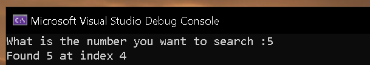

  local_178[2] = 1;
  local_178[3] = 2;
  local_178[4] = 3;
  local_178[5] = 4;
  local_178[6] = 5;
  local_178[7] = 6;
  local_178[8] = 7;
  local_178[9] = 8;
  local_178[10] = 9;
  printf("What is the number you want to search :");
  scanf_s("%d");
  local_114 = 9;

we have a array initialization local 178 . Then we are taking user input, looks like this is some searching algorithm. WE have a local 114 = 9 which looks like is the size of array since array also has 9 elements.

  array[2] = 1;
  array[3] = 2;
  array[4] = 3;
  array[5] = 4;
  array[6] = 5;
  array[7] = 6;
  array[8] = 7;
  array[9] = 8;
  array[10] = 9;
  printf("What is the number you want to search :");
  scanf_s("%d");
  size = 9;

  we can mark up the code for better understanding

local_f4 = 0;
    do {
    if (8 < local_f4) {
      printf("Not found");
      return 0;
    }
    if (local_134 == array[local_f4 + 2]) {
      printf("Found %d at index %d");
      goto LAB_140011a33;
    }
    local_f4 = local_f4 + 1;
  } while( true );
}

then we have a loop where local f4 appears to be the initizalization of int i = 0 and the loops runs till it finds the searched number or end of array search failure case ( if i > size - 1){return} . In the loop we are comparing local 134 which appears to be the user input with every elements of array to find the coorect match and print out the index where the number lives. This appears to be a liner search algorithm.


  int_i = 0;
  do {
    if (8 < int_i) {
      printf("Not found");
LAB_140011a33:
      _RTC_CheckStackVars(local_198,&DAT_14001ad50);
      return 0;
    }
    if (user_input == array[int_i + 2]) {
      printf("Found %d at index %d");
      goto LAB_140011a33;
    }
    int_i = int_i + 1;
  } while( true );
}
the marked up version can be created like this 


output 


as we can see if we use 5 as an input we get the output found the number at index 4 which if we look at the array is correct
array[size] = {1,2,3,4,5};


if we give 91 as input which is not present in the array the program will look through each element of array , wont find any match and terminate at NULL and print out not found 

  


# Linear Search

## Original Program Behavior

The program initializes an array, asks the user for a number, and searches for that number within the array.

If the number is found, the program prints the index at which it exists. Otherwise, it prints a failure message.

## Decompiled Analysis

Examining the decompiled code in Ghidra reveals the following initialization:

```c
local_178[2] = 1;
local_178[3] = 2;
local_178[4] = 3;
local_178[5] = 4;
local_178[6] = 5;
local_178[7] = 6;
local_178[8] = 7;
local_178[9] = 8;
local_178[10] = 9;

printf("What is the number you want to search :");
scanf_s("%d");

local_114 = 9;
```

The values stored in `local_178` form a sequence from `1` to `9`, indicating that the variable is being used as an array.

Immediately afterwards, the program prompts the user for input and stores the value entered.

The variable `local_114` is assigned the value `9`, which corresponds to the number of elements present in the array.

For readability, the variables can be renamed as:

```c
array[2] = 1;
array[3] = 2;
array[4] = 3;
array[5] = 4;
array[6] = 5;
array[7] = 6;
array[8] = 7;
array[9] = 8;
array[10] = 9;

printf("What is the number you want to search :");
scanf_s("%d");

size = 9;
```

## Analyzing the Search Logic

Further down the function we encounter the following loop:

```c
local_f4 = 0;

do {
    if (8 < local_f4) {
        printf("Not found");
        return 0;
    }

    if (local_134 == array[local_f4 + 2]) {
        printf("Found %d at index %d");
        goto LAB_140011a33;
    }

    local_f4 = local_f4 + 1;

} while (true);
```

The variable `local_f4` acts as a loop counter and is initialized to `0`.

The loop iterates through the array one element at a time, comparing the user input against the current array element.

If a match is found, the program prints the value and its index.

If the loop reaches the end of the array without finding a match, the program prints `Not found` and exits.

After renaming the variables, the logic becomes much easier to understand:

```c
int_i = 0;

do {
    if (8 < int_i) {
        printf("Not found");
        return 0;
    }

    if (user_input == array[int_i + 2]) {
        printf("Found %d at index %d");
        return 0;
    }

    int_i++;

} while (true);
```

## Identifying the Algorithm

This implementation is a classic **Linear Search** algorithm.

Several characteristics make this easy to identify:

1. The search starts from the first element of the array.
2. Each element is checked sequentially.
3. The loop terminates immediately when a match is found.
4. If no match is found after examining every element, the search fails.

Unlike Binary Search, there is no midpoint calculation or array splitting. Every element is visited one after another until a match is discovered or the end of the array is reached.

## Success Case

Using `5` as input produces the following result:


The program reports that the value was found at index `4`.

Looking at the array:

```c
int array[] = {1, 2, 3, 4, 5, 6, 7, 8, 9};
```

the value `5` is indeed located at index `4`, confirming that the search logic is functioning correctly.

## Failure Case

Using `91` as input produces:


Since `91` does not exist within the array, the loop checks every element from beginning to end without finding a match.

Once the final element has been examined, the termination condition is reached and the program prints:

```text
Not found
```

## Key Takeaways

* Arrays often appear in decompiled code as a series of individual assignments.
* Renaming variables significantly improves readability and understanding.
* A loop that checks each element sequentially is a strong indicator of a Linear Search algorithm.
* Failure conditions are often implemented as a boundary check on the loop counter.
* Studying decompiled output helps build intuition for recognizing common algorithms in compiled binaries.
