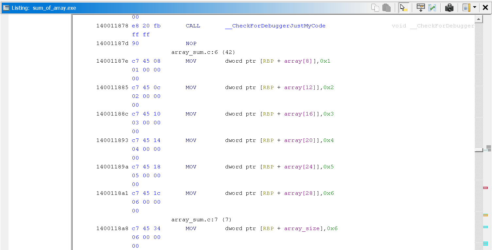

//Objective:
C code which prints the sum of all elements of an array

//Tools used:
Visual studio : Used to write C code and compile it into an executable.
Ghidra : Static analysis 
X64Dbg : Dynamic analysis

/Exe build: 
This program was compiled in debug build with 0d optimization.

/Source code:


The code logic is very simple it has a array of integers which is getting passed through a loop in a 
function called "sum_array". Where the value of sum is initially set to 0 and this value gets updated 
as the loop runs resulting in addition of every element into the sum wtih each loop and the function then 
returns the final value of sum  which is then used in the printf statement.


After you build the C program and analyze it in Ghidra you can find the main function using the Strings feature where 
you can find the "The sum of array is" string which is hardcoded in the original C code.

Inside the main function we can see that there is a initilization of "local_128" with values 0,1,2,3,4,5,6 which are 
exactly the value which were used in the source code which indicated this "local_128" is our array and we can rename this.

```asm
local f4 = 6;
sum_array(local_128 + 2 , 6);
```

We can see there is a initilaization of "local_f4" = 6 which we can actually guess is the size of array from the source code
or even if u look the surroundings of the Assembly code like initialization of a array of size 6 and then the function call 
in the next line which takes 2 parameters which one can guess would be array and size of array if u want to do a array sum. 

.PNG)

Thus, from our findings we can mark up some of the code for better reading and undeerstanding as above where we renamed the 
"local_128" and "local f4" variable.

.PNG)

When we get inside of the "sum_array" function this is the decompiled C we can see. 
Here we can see that there is a "local_114" = 0; which we can guess is the value of sum according to our source code. 
Also if we check the for loop in the next line we can see "local_114 = local_114 + local_f4 which looks exactly like our 
"sum = sum + i" in the source code. From this we can also deduce that local_f4 must be "i" . Whuch we can confirm since in the 
loop we can see a initialization of local_f4 = 0 and local_f4 = local_f4 + 1 which is exactly same as int i = 0 and i++.
Thus we can note this changes and mark up the code.


The renamed variables now show us the code logic clearly and can be used to easily extract the original code logic of calculating  
the sum of array.



When we get in the assembly code inside our main function we can see our array and array size initilization which we can see is happening at a offset location from RBP.

.PNG)

```asm 
MOV     EDX,dword ptr [RBP+array_size]
LEA     RCX => array[8],[RBP+ 0x8]
CALL    sum_array
```
Here we can see that we are calling our "sum_array" function where we are passing our array and array size as the two parameters.
How do we know that ? We can see that before our function call we can see we have a MOV and LEA instruction where we are dealing with array and array size but what confirms our assumption is according to windows calling conventions our arguments are stored in the order RCX RDX R8 R9 and we can see RCX AND EDX getting initalized here as well which confirms our assumption.

```asm 
MOV     EDX,EAX
LEA     RCX,[s_The_sum_of_array_is_%d_]
CALL    printf
```

And we can see after the function call we have a MOV instruction which means our function is going to reuturn us our sum via EAX which will be used to print out the printf statement in the next line.

.PNG)

Here we can see that there is a initialization of int i = 0; which then takes the jump to the core logic of the loop and then increments "i" with "INC EAX".
As we enter the loop for the first time we can see that: The value inside "Local res10" is getting moved into EAX which is then getting compared with i and then has a JG jump in next instruction which helps us to guess that this "Local res10" might be our array size and we can deduce everything here as: 
local res = array size 
if(i > array size){
    jump;
}

after this logic we can see value inside rbp+i is getting moved in EAX which is then involved in a instruction: 
add array_value + EAX where array value is our value of sum and rbp+i is same as value of array[i]; resulting in 
sum = sum + i;
Here our RIP will jump back at start of our loop after all these logic while incrementing EAX (value of i) and updating value of sum

Here our final sum value is stored in [rbp+sum] and EAX.

```asm 
MOV     EDX,EAX
LEA     RCX,[s_The_sum_of_array_is_%d_]
CALL    printf
```
If we remeber from instruction i mentioned before we can see the valye of EAX being moved into EDX after the function call of "sum_array" which indicates the returned value is stored in EAX which we confirmed a momement ago.Thus giving us the final result.


